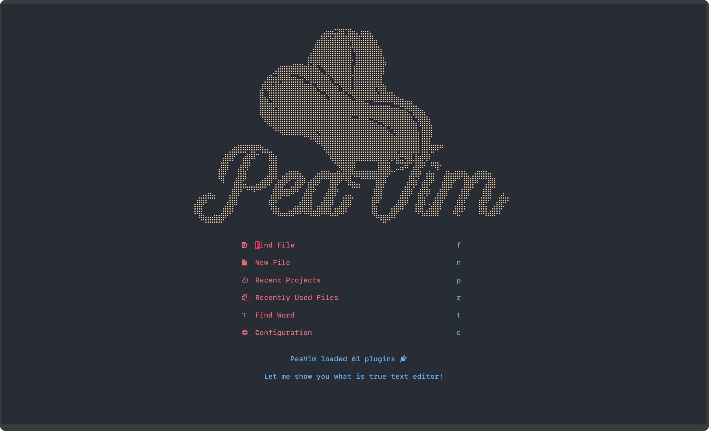
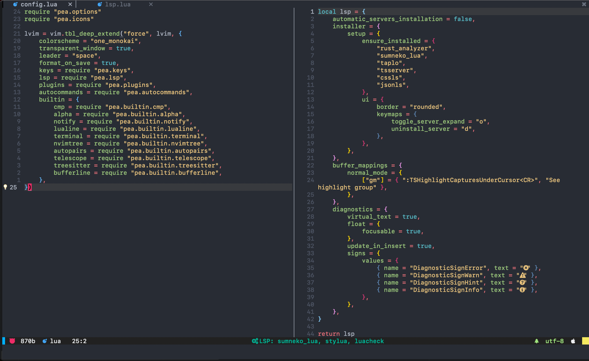

# lvim

My LunarVim configuration, inspired from my [Peavim](https://github.com/cpea2506/peavim) config




### One Line Installation Command

```bash
bash <(curl -s https://raw.githubusercontent.com/cpea2506/lvim/main/utils/install.sh)
```

This will install LunarVim for you if there isn't any.

### Requirement

- Neovim >= 0.8

### Options

#### [Treesitter](lua/pea/builtin/treesitter.lua)

You can ensure install by specifying your list of languages or using `"all"`.

```lua
{
     ensure_installed = {"rust", "swift", "lua", ...}
}
-- or
{
     ensure_installed = "all"
}
```

#### [LspInstaller](lua/pea/lsp.lua)

You can ensure install by specifying your list of servers

```lua
{
     ensure_installed = {"rust_analyzer", "sumneko_lua", ...}
}
```

#### GUI:

If you are using `Neovide` and/or `Vimr`. You need to do these things to make it receive LunarVim config:

1. Go inside `lvim/utils` folder: `cd $HOME/.config/lvim/utils`
2. Setup

- Neovide

  ```bash
  chmod +x ./lvide

  mv ./lvide $HOME/.local/bin/.
  ```

- Vimr

  ```bash
  chmod +x ./lvimr

  mv ./lvimr $HOME/.local/bin/.
  ```

3. Now you can start using `lvide` for `neovide` and/or `lvimr` for `vimr`
